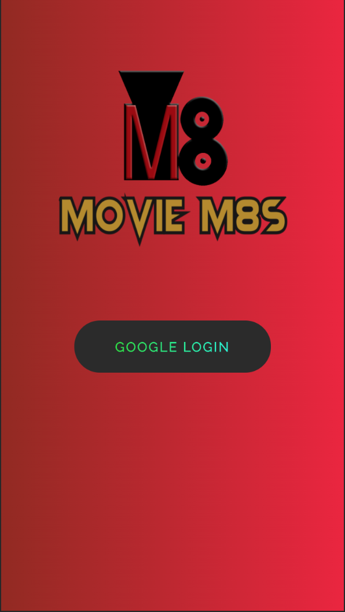

<p align="center">
 
</p>

<h3 align="center">Duo Project by Carlos Salazar and  Kohki Shiga</h3>

# 🎥 Movie M8s

<p align="left">
 
</p>


**A mobile-friendly app that lets you swipe left to dismiss a movie if you’re not interested in watching it, or right to save it in your “To Watch” list.**

## Getting Started (Installation)

### Step 1
```
git clone https://github.com/CarlosIUSalazar/MovieM8S-Test.git
```

### Step 1
```
npm install
```

### Step 2
```
npm run start
```


## ✈️ Deployment

<p align="center">
 
</p>

 <h4 align="center">You can visit our site here: http://www.moviem8s.com/ </h4>


## 🏗️Built With

-   [React](https://reactjs.org/)  - Frontend Javascript Framework
-   [SCSS](https://sass-lang.com/)  - CSS Extension Language
-   [AWS Amplify](https://aws.amazon.com/amplify/)  - Development platform for building secure, scalable mobile and web applications
- [Firebase](https://firebase.google.com/) - NoSQL Database

## 🤝 Contributors / Acknowledgments

- [Carlos Salazar](https://github.com/CarlosIUSalazar)

- [Kohki Shiga](https://github.com/CarlosIUSalazar)

## Summary
Round of Applause 👏👏👏 to Carlos and Kohki for building this app within 4 weeks. We really enjoyed using useSpring hooks to imitiate the swiping movement on screen. We are planning to improve on this app so that it can handle multiple users. Sit tight for our next update!!! 💪
